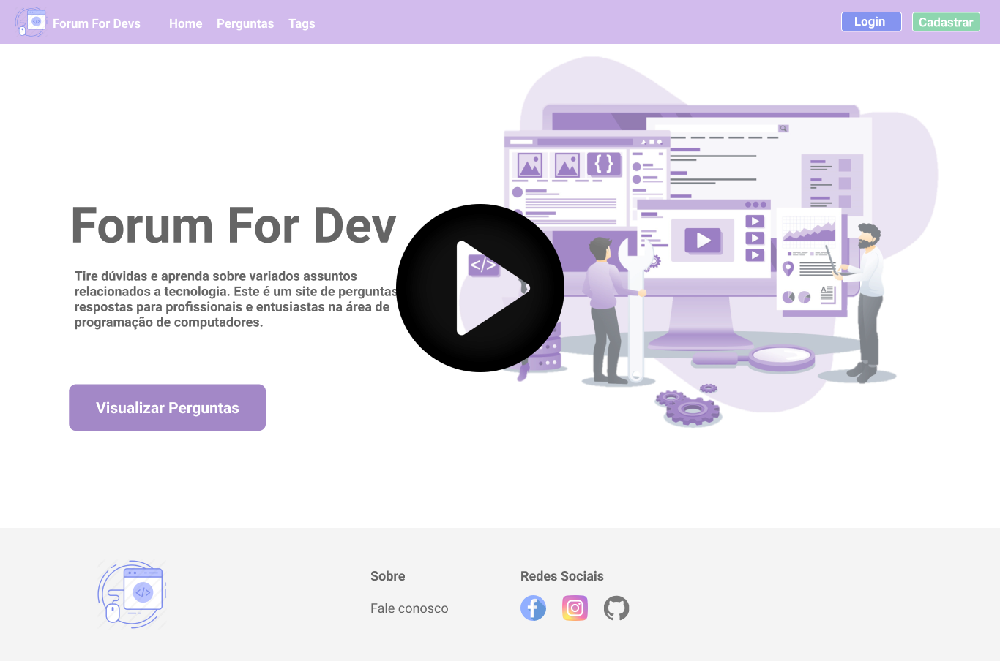

## Forum For Devs (Frontend)

Aplicação desenvolvida em ReactJS, trata de um fórum de perguntas e respostas sobre tecnologia. Essa aplicação consume dados de uma [API Rest desenvolvida em NodeJS](https://github.com/Eleson-Souza/forum-for-devs_server).

### :rocket: Tecnologias 
* ReactJS
* NodeJS
* JavaScript
* HTML
* CSS
* MySQL

### :movie_camera: Demo
[]

## :page_facing_up: Licença

Este projeto está sob a licença MIT License - veja o arquivo [LICENSE.md](https://github.com/Eleson-Souza/forum-for-devs_web/blob/master/LICENSE) para detalhes.

### ✒️ Autor

* Eleson Souza

### Social
[Acesse meus repositórios GitHub](https://github.com/Eleson-Souza?tab=repositories)

[Acesse meu LinkedIn](https://www.linkedin.com/in/eleson-souza-97735a174/)
